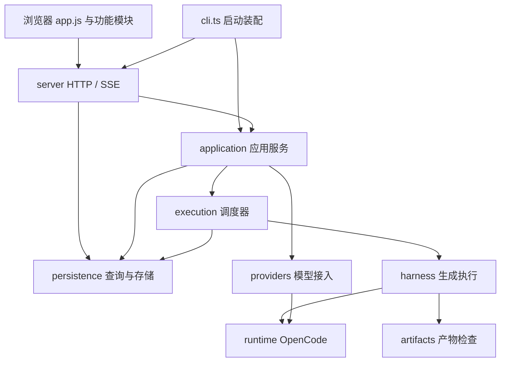

# 模块化架构

Game-Gen 使用模块化单体架构：一个 Node.js 进程、一个 SQLite 数据库、一个静态前端。模块按职责组织，通过显式构造参数或函数参数协作；本次改造不引入新的部署服务或前端框架。

## 模块职责

| 目录 | 职责 | 主要入口 |
| --- | --- | --- |
| `src/domain` | 实验、运行、轮次、事件、Harness 接口及结构化失败契约 | `types.ts`、`harness-failure.ts` |
| `src/application` | 题库管理、供应商连接、实验创建、恢复与统一生命周期操作 | `control-plane.ts`、`experiment-commands.ts`、`experiment-manager.ts` |
| `src/execution` | 派发与并发、单次运行、熔断恢复、超时与归档 | `orchestrator.ts`、`run-executor.ts`、`infrastructure-recovery.ts` |
| `src/harness` | 统一生成执行接口，提供 Mock 与 OpenCode 实现 | `index.ts`、`opencode/harness.ts` |
| `src/providers` | 接入装配、配置持久化、模型验证与缓存、供应商协议适配 | `opencode-service.ts`、`managed-provider-store.ts`、`model-verifier.ts`、`packy-catalog.ts` |
| `src/runtime` | OpenCode 进程启动、连接、配置和关闭 | `opencode.ts` |
| `src/persistence` | SQLite 读写、迁移、事件保留、工作目录和上下文文件 | `database.ts`、`events.ts`、`workspace.ts` |
| `src/artifacts` | 生成产物完整性与 JavaScript 语法检查 | `validation.ts` |
| `src/server` | HTTP 生命周期、路由、SSE、请求校验、安全响应和静态资源 | `dashboard-server.ts`、`routes/` |
| `src/public/modules` | 设置状态、纯查询、API 操作、页面协调器与功能视图 | `setup-store.js`、`setup-selectors.js`、`setup-data.js`、`setup-controller.js` |

`src/cli.ts` 负责启动装配；`src/config.ts` 负责配置与题库解析；`src/prompt-context.ts` 提供 Prompt 上下文工具。

## 调用关系



HTTP 查询仍通过只读接口访问持久化层。重试、阶段推进、暂停、恢复、取消和收尾统一经过 `ControlPlane` → `ExperimentCommands`；CLI 的配置启动和启动恢复也使用这些应用入口。路由不再自行准备运行时、调用 Manager 或修改数据库。`DashboardServer` 构造函数保留旧 Manager 参数用于调用兼容，路由上下文不暴露它。

## 边界规则

1. `domain` 不依赖应用层、HTTP、数据库或供应商实现。
2. 存储、执行器和供应商适配层不得反向导入 `application` 或 `server`。
3. 内部代码直接导入实现所属模块；根目录旧文件仅作为兼容导出，保留已有脚本和测试的导入路径。
4. 本地模块依赖必须无环，包括类型导入和动态导入。
5. 前端功能模块仅导入基础格式、状态定义及只读 selectors；视图不相互导入或互传渲染函数。`app.js` 单向装配 store、data、views 和 controller。
6. 各组件共用由 `BenchmarkDatabase` 管理的 SQLite 连接。`EventStore` 负责事件写入、分页、截断和保留策略，并将事件发布回原数据库事件流；事务使用同一连接。
7. `ControlPlane` 保留统一应用接口，但题库、供应商连接、实验配置分别交给独立服务。目录查询、凭证、发现、配置、验证、运行时使用各自的窄接口；`ProviderGateway` 只作为装配时的兼容组合。实验创建仅依赖目录读取、验证和运行时准备能力。

这些依赖规则由 `tests/module-boundaries.test.ts` 自动检查。前端模块通过受限的 `/modules/*.js` 路径提供，不扩大为整个源码目录的文件服务。

## 执行状态的归属

| 组件 | 负责的状态和操作 |
| --- | --- |
| `OrchestratorManager` | 活动实验、生命周期互斥、手动重试回滚 |
| `GenerationOrchestrator` | 实验生命周期、任务领取、并发计数与派发 |
| `RunExecutor` | 已领取运行和轮次的执行、失败分类、重试与结果状态 |
| `InfrastructureRecovery` | 私有熔断状态、恢复预算、排队任务只读探测、探针预约与释放 |
| `RunArchive` | 结果清单、上下文采集和归档，不能决定派发 |

调度器传入明确的生命周期查询和授权暂停回调，执行器不持有整个调度器对象。执行器不得自行领取下一任务，恢复组件不得执行生成轮次。停止与取消仍沿用同一运行的 `AbortSignal`。

## Harness 扩展契约

执行层使用 `HarnessFailure` 的 `kind`、`retryable` 和 `scope` 决策，不解析展示文案。OpenCode/上游诊断的文字匹配集中在 OpenCode 适配器边界。

```ts
import { HarnessFailure } from "./harness/index.js";

throw new HarnessFailure("渠道暂时不可用", {
  kind: "infrastructure",
  scope: "provider", // engine 表示整个执行引擎；provider 表示一个供应商
  retryable: true,
});
```

错误种类包括 `infrastructure`、`authorization`、`incomplete`、`artifact`、`timeout`、`execution`。不可重试错误不自动续跑；授权错误保留暂停派发、等待人工处理的行为。普通 `Error` 走有限尝试次数的通用失败路径，不能再通过某段文字隐式触发熔断。已有自定义 Harness 应按此契约迁移。

`checkInfrastructure` 使用通用 `engine | provider` 范围。适配器可通过 `context.reportHealthy(scope)` 报告探针健康，`context.emit` 只承载事件，不用于传递特定 SDK 的隐式控制信号。新增引擎仍需实现接口、注册工厂，并扩展配置校验中的 Harness 枚举。

SQLite 自动新增 `infra_scope` 与 `infra_failure_kind`。重启依据这些字段恢复策略；旧记录缺少范围时保守按引擎级单探针恢复。新的 `incomplete` 记录仅控制该运行的续写等待，不恢复为全局熔断。无需清空旧数据库。

## 前端状态流

题库、模型选择、供应商目录和验证记录通过 `setup-store` 的命令修改；视图读到的业务快照被冻结，不能直接改写。`setup-selectors` 提供共享查询；`setup-data` 负责网络请求及每个题库的串行自动保存，并忽略过期保存响应。

服务端 `DatasetService` 对所有题库共用的选择文件统一排队写入；首次加载复用同一 Promise，写入成功后才发布新的内存状态。验证记录变化时，模型视图只刷新状态标记，保留正在编辑的输入行。

`setup-controller` 订阅变更，合并同一轮事件的界面刷新，处理跨弹窗交互。编辑名称或并发时不重建正在输入的模型行。上传进度、OAuth 弹窗、并发策略等临时 UI 状态仍由原功能管理，监控模块保持自己的状态和 SSE 生命周期。

## 供应商接入的归属

`OpenCodeService` 单点管理运行时生命周期和兼容 API。`ManagedProviderStore` 管理渠道元数据，凭证仍由 OpenCode auth store 保存；`ModelVerifier` 管理能力验证、缓存、会话探测与资源清理；`PackyCatalogService` 管理目录 TTL、同一请求合并和失败时旧目录回退。网络安全校验继续位于供应商适配层。

验证缓存以供应商、模型和推理档位共同索引，默认档位独立保存。持久化格式为 version 2；旧版 OpenCode 验证记录缺少档位信息，因此升级后需要重新验证，不能直接作为可用依据。已验证模型切换到未经验证的档位时，页面提示“档位待实测”，创建任务前由服务端完成该档位的实际验证。

调度器在执行器停止、结果清单落盘和最终状态写入完成后才标记 `settled`。关闭流程等待正在进行的收尾，并合并重复关闭请求。阶段推进先加载配置；启动失败时恢复原阶段和实验状态，并尝试同步恢复结果清单，允许用户再次推进同一阶段。

## 修改功能时从哪里开始

| 修改需求 | 主要修改位置 |
| --- | --- |
| 新增题库校验或导入行为 | `application/datasets.ts`、`application/schemas.ts`、`config.ts` |
| 新增供应商接入 | `providers/` 与 `application/provider-connections.ts` |
| 修改重试、预算或故障恢复 | `execution/run-executor.ts`、`infrastructure-recovery.ts`、`generation-budget.ts` |
| 修改阶段推进、重试等完整操作 | `application/experiment-commands.ts`、`experiment-manager.ts` |
| 修改 OpenCode Prompt 或事件映射 | `harness/opencode/prompts.ts`、`events.ts`、`messages.ts` |
| 新增数据库字段 | `persistence/schema.ts`、`rows.ts`、对应读写方法、`domain/types.ts` |
| 修改事件清理策略 | `persistence/events.ts` |
| 新增 HTTP 接口 | `server/routes/` 对应业务文件；保留统一写请求校验 |
| 修改监控页面 | `public/modules/monitor.js`，必要时在 `public/app.js` 注入依赖 |

## 验证与兼容性

```powershell
npm.cmd run typecheck
npm.cmd test
npm.cmd run build
```

`npm test` 包含模块边界、浏览器模块加载、前端状态不可变性与草稿保存顺序、应用命令、供应商缓存与清理、结构化错误、HTTP 安全、SQLite 迁移、调度并发及重启恢复测试。构建继续将前端目录递归复制到 `dist/src/public`。

现有启动命令、HTTP URL、数据库文件位置、产物目录格式和旧 TypeScript 导入入口保持兼容；自定义 Harness 的专用失败处理需要采用上述显式契约。此前对初始生成预算、手动重试、生命周期冲突和 ES module 语法检查的修复继续保留。

本次仍使用共享浏览器状态和单进程调度；若未来引入多用户或多进程 Worker，需要另行设计身份隔离、任务租约和跨进程并发控制，不能仅依靠当前模块拆分获得这些能力。
